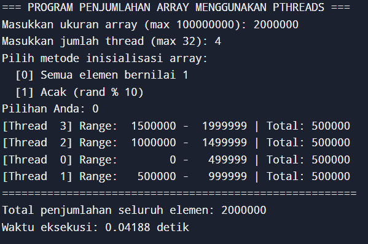
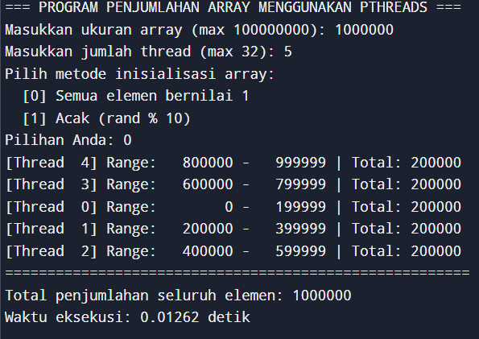

# Parallel Array Summation using Pthreads

Program ini menjumlahkan elemen-elemen array secara paralel menggunakan Pthreads (POSIX Threads) dalam bahasa C

## Fitur

- Input interaktif
- Pemrosesan paralel dengan Pthreads
- Output hasil penjumlahan setiap thread
- Total penjumlahan seluruh array dan waktu eksekusi

## Contoh Output

